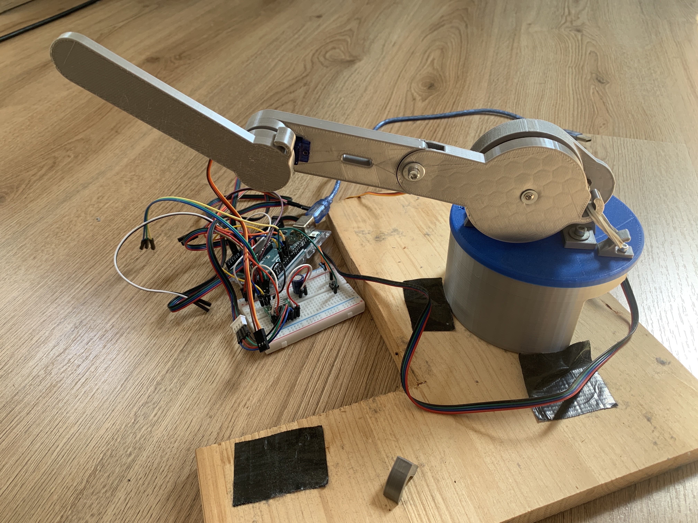
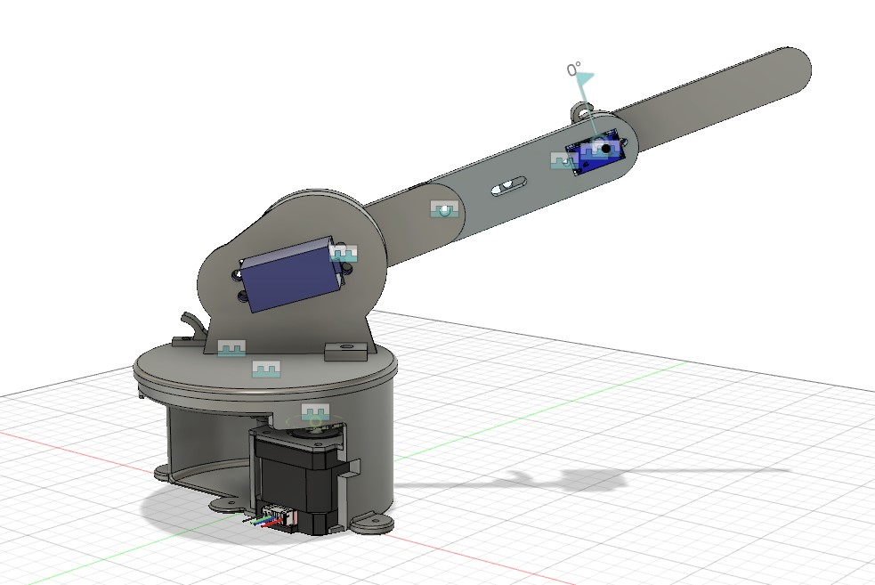
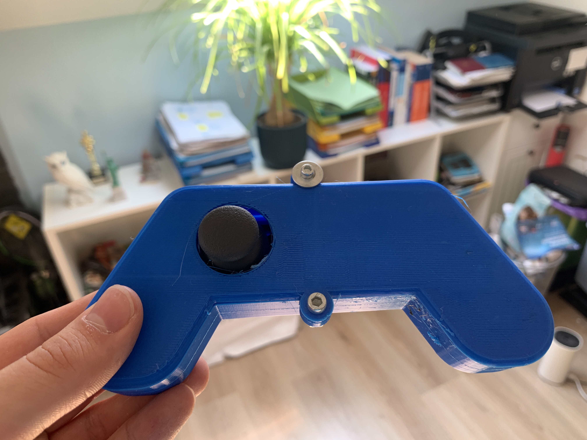
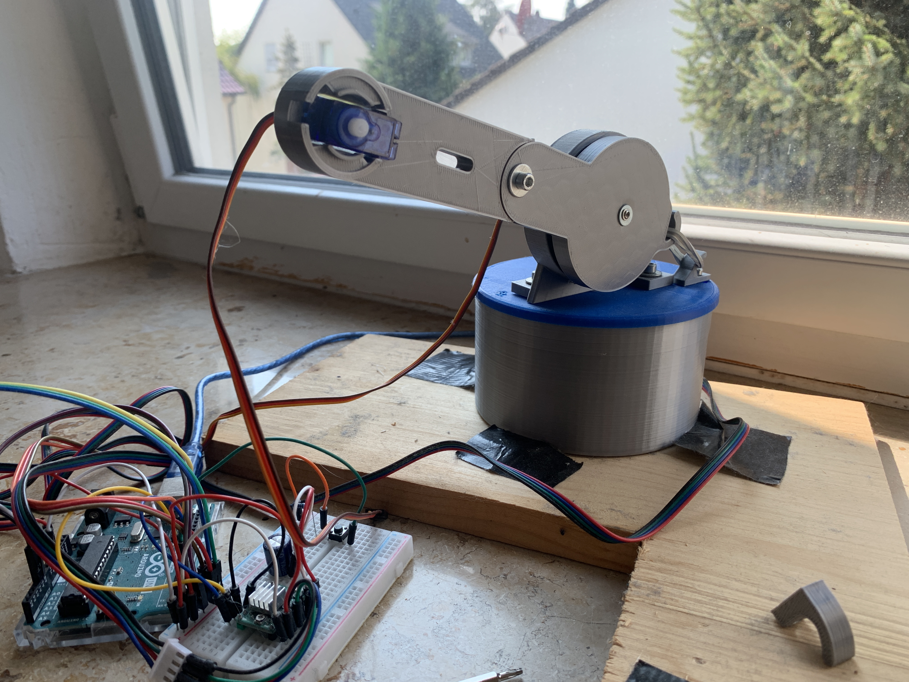
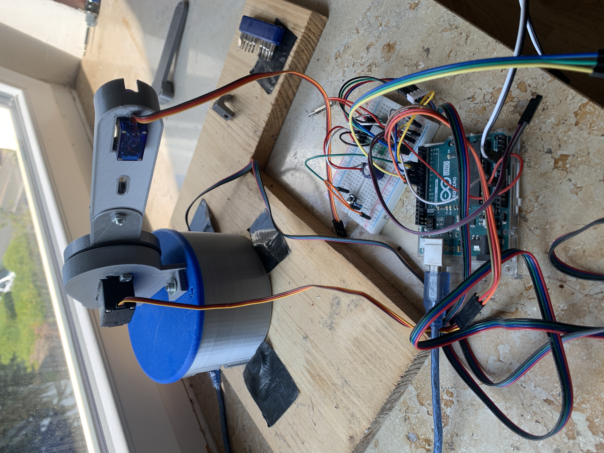
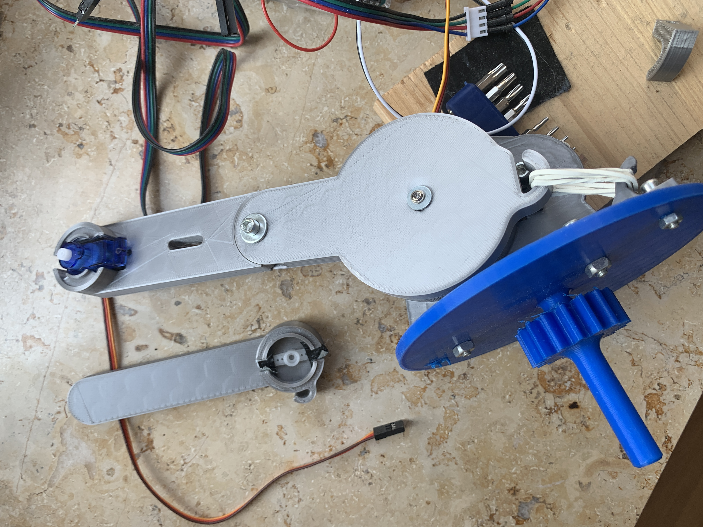
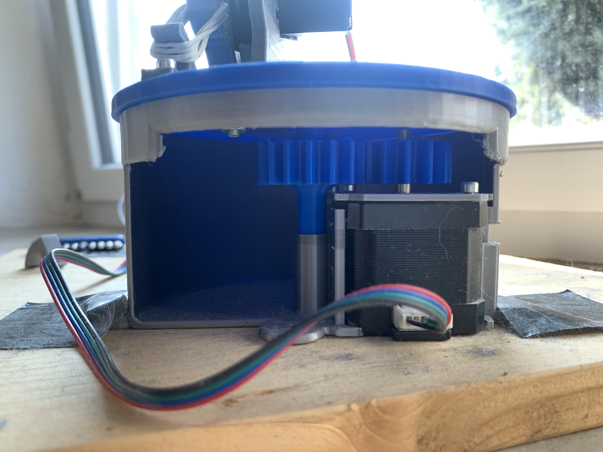
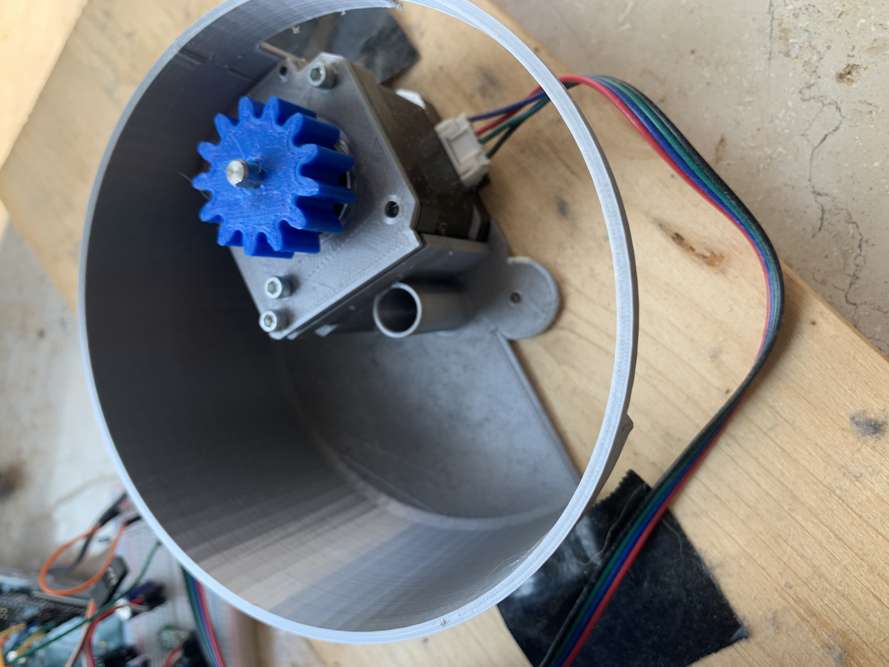

DIY Roboterarm mit 3 Freiheitsgraden und Controller, der Servos und einen Stepper-Motor verwendet und komplett mit Fusion 360 und dem 3D-Drucker konstruiert wurde.

Der gesamte Arm kann am Fuß rotiert werden, hierfür ist ein Stepper-Motor mit einem simplem Getriebe zuständig, der im Fuß verbaut ist.  
Der Arm besteht aus einer unteren Halterung, die den unteren Servo aufnimmt. Dieser bewegt den gesamten Arm.  
Am Arm selber ist ein zweites Gelenk, das heißt ein zweiter Servo, verbaut, der den oberen Teil des Arms bewegt.  
Alle drei Motoren werden von einem Arduino mithilfe eines Joystick-Controllers gesteuert.  

Beim Bau und Test gab es einige Herausforderungen:
- Das größte Problem ist ein mechanisches: Die Servos können den Arm zwar bewegen, allerdings reicht ihr Drehmoment bzw. ihr Getriebe nicht ganz aus, 
um den Arm z.B. im "ausgestreckten" Zustand zu halten. Um dies zu lösen habe ich den Arm etwas verkürzt, 
versucht beim 3D-Druck Gewicht zu sparen und insbesondere Gummibänder mit Halterungen verbaut, die der Gewichtskraft ein zusätzlich Gegendrehmoment entgegensetzen.
Das funktioniert leider noch nicht perfekt, aber gut genug. Eine mögliche Weiterentwicklung wären stärkere Servos.
- Der Stepper-Motor benötigt einen Treiber mit eigener Stromversorgung und Kühlkörper (läuft heiß). Hierfür kann eine 9V-Batterie angeschlossen werden. Als rudimentäre
Spannungsstabilisierung zwischen Batterie und Stepper-Treiber dient ein (Elektrolyt)Kondensator. Eine mögliche Weiterentwicklung wäre eine bessere Spannungsversorgung mit Spannungsregler(n),
die dann auch gleich den Arduino mitspeisen kann.

Bilder aus der Entwicklung:

